# Machine Learning

## Përshkrimi i detyrës

Ky projekt synon të zgjidhë sfidat e orarizimit në universitete teknika të avancuara të Machine Learning. Ne jemi fokusuar në analizën dhe përpunimin e dataseteve të propozuara gjatë viteve 2020-2023, të cilat përfshijnë të dhëna të orarizimit në universitete. Dataseti që kemi përzgjedhur është:

**[Software Industry Salary Dataset - 2022](https://www.kaggle.com/datasets/iamsouravbanerjee/software-professional-salaries-2022)** nga **[Kaggle](https://www.kaggle.com)**.

## Startimi i projektit

1. Se pari bëni instalimin e python-it në pajisjen e juaj.
2. Klonimi i projektit: **[InteligjencaArtificiale](https://github.com/BleronaIdrizi/InteligjencaArtificiale.git)**.
3. Ekzekutimi i komandës për instalimin e librarive në direktoriumin ku është i vendosur projekti:

```python
cd Projekti_3
pip3 install -r requirements.txt
```

## Priprocesimi i te dhënave

- Se pari marrim informata rreth datasetit tonë:

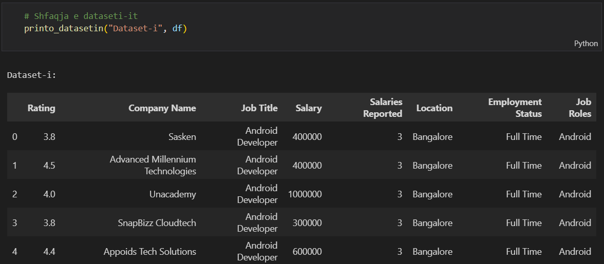

- Pastaj shikojmë llojet e të dhënave:

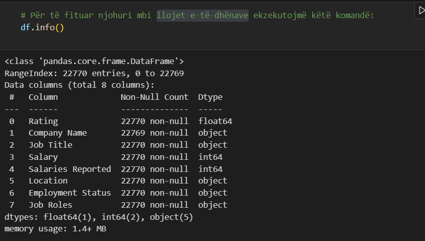

- Pastaj shikojmë nese të dhënat përmbajne vlera null:

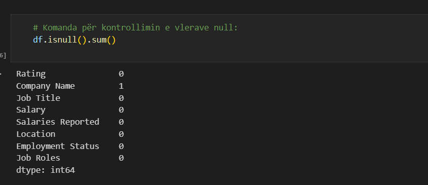

- Pasi që kemi kontrolluar null values, ne kemi gjetur vetem një vlerë null dhe e kemi fshirë:

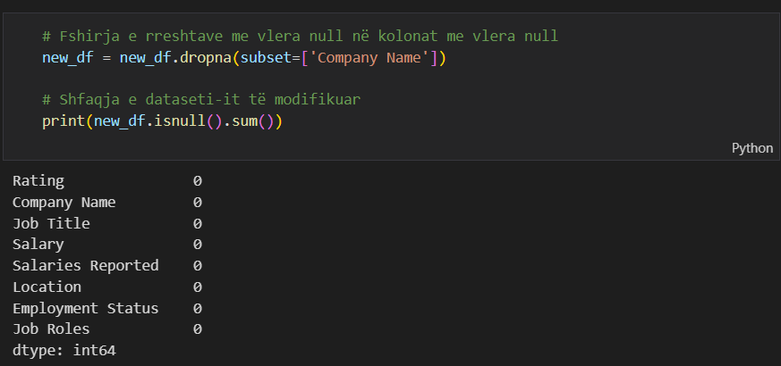

- Ne kemi kontrolluar për duplikateve, mirepo dataseti nuk ka përmbajtur vlera duplikate:

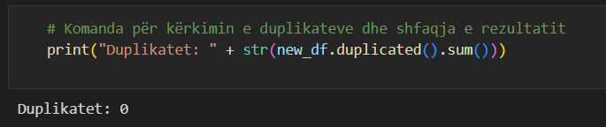

- Kontrollimi i outliers në kolonën Salary:

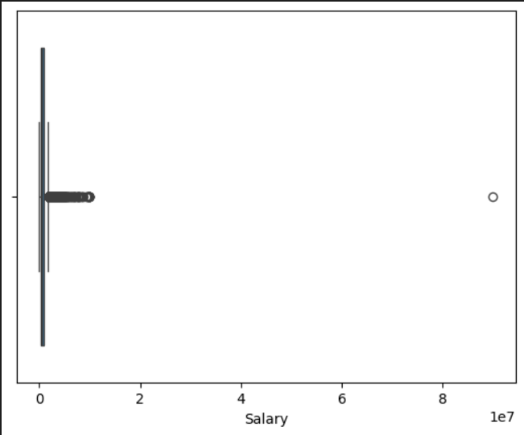

- Pas largimit të outliers boxplot-i merr formën:

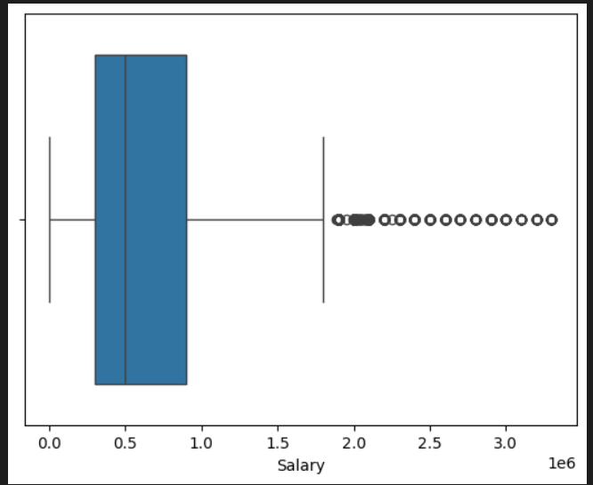

- Paraqitja e të dhënave të shtrembura në datasetin origjinal:

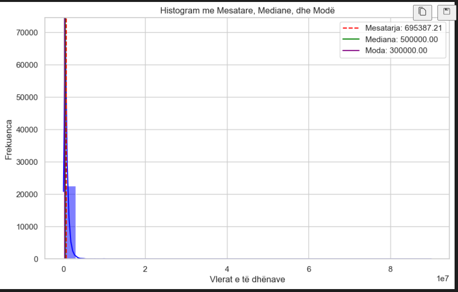

- Pas largimit të outliers paraqitja etë dhënat të shtrembura duken kështu:

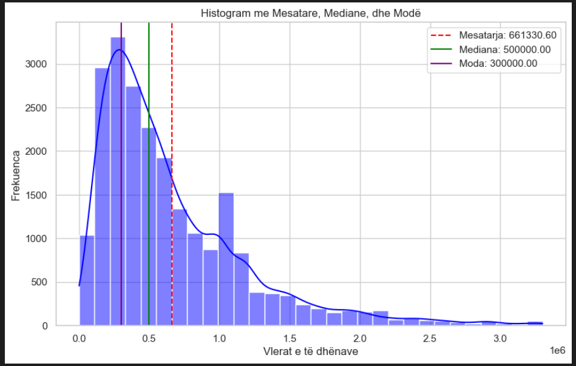

- Raporti i kolonave sipas KMeans algoritmit duken kështu:

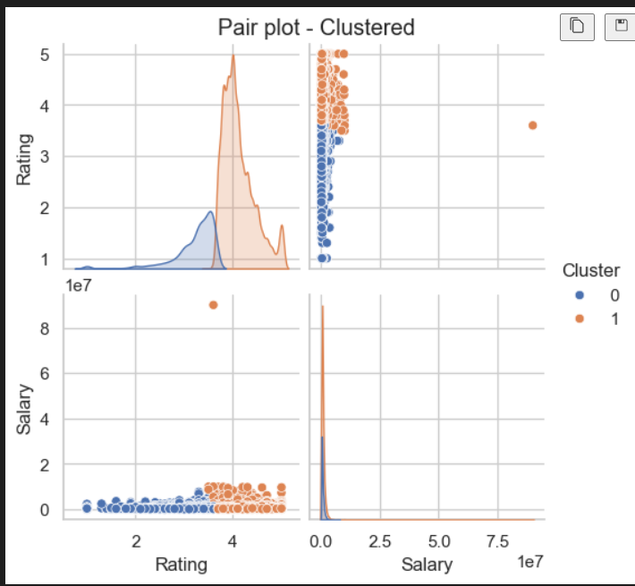

- Saktësia e datasetit sipas kalkulimit të devijimit standard është 0.46:

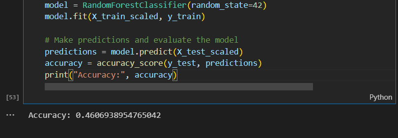

### Algoritmi LightGBM

Sipas këtij algoritmi ne kemi fituat këto rezultate:

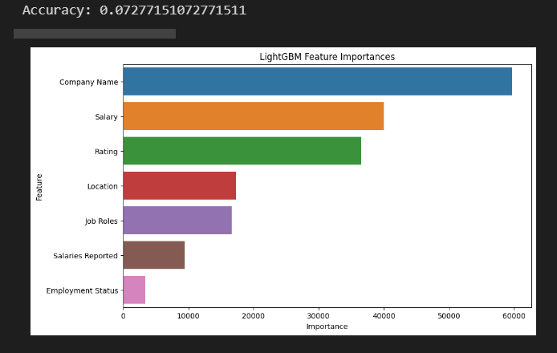

Grafiku i rëndësisë së karakteristikave të gjeneruar nga modeli LightGBM na jep një pasqyrë të faktorëve që kanë ndikimin më të madh në parashikimin e variablës së synuar. Grafiku tregon rëndësinë relative të secilës karakteristikë, ku vlerat më të larta tregojnë një ndikim më të madh në vendimet e modelit. Nga grafiku mund të vërejmë:

- Company Name ka rëndësinë më të lartë, duke sugjeruar se emri i kompanisë është një parashikues i rëndësishëm në të dhënat, mundësisht për shkak të reputacionit ose sektorit të kompanisë.
- Salary është karakteristika e dytë për nga rëndësia, që tregon ndikimin e saj të fortë në variablen e synuar, i cili mund të jetë i lidhur me rolet e punës dhe vlerën e tyre në treg.
- Rating dhe Location gjithashtu tregojnë një rëndësi të konsiderueshme, që mund të reflektojë se vlerësimi i një kompanie dhe vendndodhja gjeografike kanë një ndikim të dukshëm në rezultatin përfundimtar.
- Job Roles, Salaries Reported, dhe Employment Status kanë një rëndësi më të vogël në krahasim me karakteristikat e tjera, por ato ende kontribuojnë në parashikimet e modelit në një farë mase.

Modeli ka identifikuar një hierarki të rëndësisë së karakteristikave që pasqyron gradët e ndryshme të ndikimit që aspektet e ndryshme të të dhënave kanë mbi rezultatin e parashikuar.
Kjo informacion mund të përdoret për të kuptuar faktorët që më së shumti ndikojnë në parashikimet e modelit dhe mund të informojë përpjekjet e mëtejshme për mbledhjen e të dhënave dhe inxhinierinë e karakteristikave.

### Algoritmi XGBoost

Sipas këtij algoritmi ne kemi fituat këto rezultate:

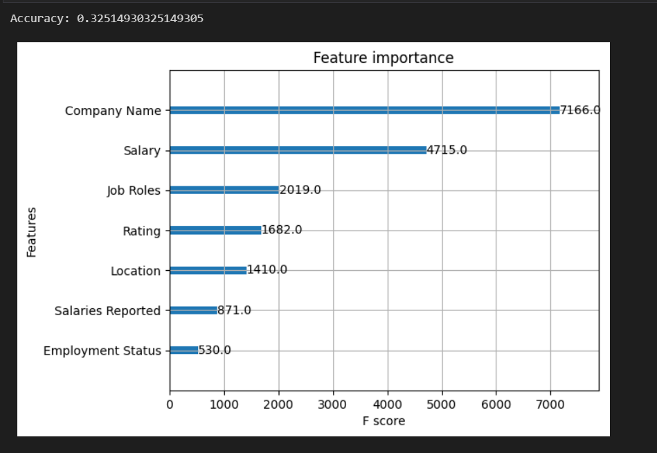

Modeli XGBoost ka vlerësuar rëndësinë e karakteristikave për të parashikuar variablen e synuar. Siç shihet nga grafiku, karakteristikat janë vlerësuar sipas skorit të tyre 'F', ku vlerat më të larta tregojnë një kontribut më të madh në modelin e parashikimit. Në veçanti:

- Company Name ka skorin më të lartë të rëndësisë, duke sugjeruar se kompania nga e cila vjen një roli i caktuar i punës ka një ndikim të madh në parashikimin e modelit.
- Salary gjithashtu ka një rëndësi të konsiderueshme, që tregon se kompensimi financiar është një faktor i rëndësishëm në parashikimin e rolit të punës.
- Job Roles, Rating, dhe Location vijojnë si karakteristika të rëndësishme, por me skor më të ulët të rëndësisë, që tregon se ato kanë një ndikim më të moderuar në model.
- Salaries Reported, dhe Employment Status kanë skorin më të ulët të rëndësisë, duke treguar se këto të dhëna mund të jenë më pak vendimtare për parashikimet e modelit.

Në përfundim, ky grafik na ndihmon të kuptojmë se cilat faktorë janë më të rëndësishëm për modelin dhe mund të na udhëzojë në përmirësimin e mëtejshëm të modelit dhe në vendosjen e prioriteteve për mbledhjen e të dhënave në të ardhmen.

### Algoritmi CatBoost
Sipas këtij algoritmi ne kemi fituat këto rezultate:

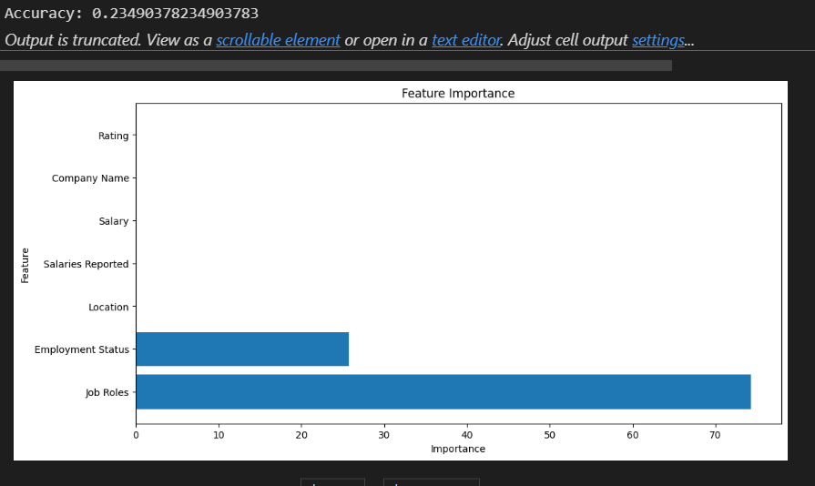

Në analizën e kryer me algoritmin CatBoost, rëndësia e karakteristikave është vlerësuar dhe rezultatet janë vizualizuar në grafikun e sipërm. Ky grafik na ndihmon të kuptojmë se cilat faktorë kanë më shumë ndikim në parashikimin e variablës së synuar. Nga të dhënat e grumbulluara, është vërejtur se:

- Job Roles dalin si karakteristika më vendimtare, duke treguar se lloji i pozicionit të punës ka ndikimin më të madh në rezultatin e modelit.
- Employment Status gjithashtu shfaqet si një faktor kyç, i cili mund të pasqyrojë rëndësinë e marrëdhënies së punësimit në vlerësimin e rolit të punës.
- Karakteristikat e tjera si Location, Salaries Reported, Slary, Company Name, dhe Rating paraqiten me një ndikim më të ulët, por akoma kontribuojnë në aftësinë e modelit për të bërë parashikime.

Në përfundim, ky grafik na ndihmon të kuptojmë se cilat faktorë janë më të rëndësishëm për modelin dhe mund të na udhëzojë në përmirësimin e mëtejshëm të modelit dhe në vendosjen e prioriteteve për mbledhjen e të dhënave në të ardhmen.


### LightGBM vs XGBoost vs CatBoost
LightGBM, XGBoost dhe CatBoost janë tre nga algoritmët më të njohur të përforcimit të gradienit me baza në pemë, të cilët janë të njohur për performancën e tyre të lartë në shumë probleme të mësimit me makina. Secili prej tyre ka avantazhet dhe veçoritë e veta që i bëjnë të veçantë në situata të ndryshme.

- LightGBM është një implementim që përqendrohet në efikasitet dhe shpejtësi. Përdor një algoritëm të quajtur "Gradient-based One-Side Sampling" (GOSS) për të reduktuar numrin e mostrave të dhënash për të përmirësuar shpejtësinë e trajnimit, pa komprometuar shumë me saktësinë. Megjithatë, në këtë rast, LightGBM ka një saktësi prej vetëm 0.07, që është shumë më e ulët në krahasim me dy algoritmet e tjera. Kjo mund të jetë për shkak të parametrave jo-optimalë, mungesës së përpunimit të të dhënave ose veçorive të caktuara që nuk janë trajtuar siç duhet.

- XGBoost është i njohur për performancën e tij të fortë dhe aftësinë për të menaxhuar mungesën e të dhënave dhe overfitting. Është i pajisur me një larmi të gjerë të teknikave të regularizimit që ndihmojnë në përmirësimin e stabilitetit dhe performancës së modelit. Me një saktësi prej 0.32, XGBoost tregon një performancë të qartësisht më të mirë në këtë krahasim, duke e bërë atë zgjedhjen më të mirë për këtë grup të dhënash specifik.

- CatBoost është një zgjidhje që përqendrohet në punimin me karakteristika kategorike dhe zvogëlon mundësinë e overfitting me teknikën e saj të quajtur "Ordered Boosting". Është i njohur për të qenë më i thjeshtë për t'u përdorur pasi kërkon më pak përpunim paraprak të të dhënave. Saktësia e tij në këtë rast është 0.23, që është më e mirë se LightGBM, por jo aq e lartë sa XGBoost.

Në këtë analizë specifike, XGBoost ka dalë si algoritmi më i mirë me saktësinë më të lartë. Kjo nuk do të thotë që XGBoost është gjithmonë superior ndaj LightGBM dhe CatBoost - përkundrazi, performanca e çdo algoritmi mund të ndryshojë në varësi të natyrës së datasetit, përpunimit të të dhënave dhe mënyrës së konfigurimit të parametrave. Për probleme të ndryshme, njëri mund të jetë më i përshtatshëm se tjetri. Prandaj, gjithmonë është e rëndësishme të kryhen eksperimente të hollësishme dhe të përshtaten parametrat për të gjetur modelin më optimal për të dhënat tuaja specifike.


